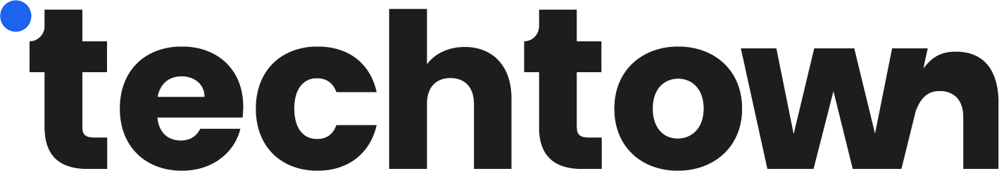

  <a href="https://techtown.fr/">
    <picture>
      <source media="(prefers-color-scheme: dark)" srcset="../media/logo-full-white.png">
      <source media="(prefers-color-scheme: light)" srcset="../media/logo-full-dark.png">
      
    </picture>
  </a>

<h2 align="center">Votre partenaire pour réaliser vos projets <a href="https://techtown.fr/">IA & Cloud</a>.</h2>

TechTown est un cabinet d'expertise nantais spécialisé dans les domaines du <b>Cloud</b> et de l'<b>Intelligence Artificielle</b>.

Nous intervenons sur des missions de conseil, des projets de réalisation et de la formation, partout en France.

> _"L'Intelligence Artificielle couplée à la puissance du Cloud va changer nos vies et celles de nos entreprises. Soyons prêts !"_

  <a href="https://techtown.fr/nous-rejoindre/">Nous Rejoindre 🚀</a>
  ·
  <a href="https://techtown.fr/formations/">Nos Formations 🎓</a>
  ·
  <a href="https://techtown.fr/expertises/">Nos Expertises 💡</a>
  ·
  <a href="https://calendar.app.google/QWGVZxqu9bVnZqXm6">Prendre RDV 👋</a>

 

## 🎯 Nos Expertises

- 🦾 **Intelligence Artificielle** — Gen AI (LLM, SLM), Formation, Stratégie AI-First
- 🤖 **Agentic IA** — Agents autonomes, RAG, Orchestrations, Évaluation et guardrails, Sécurité, Connecteurs outils et APIs
- 💻 **Dev Augmenté** — Assistants IA (Cursor, Copilot, Claude Code, etc), MCP et Agent Skills, Vibe-coding, Developer eXperience
- ☁️ **Cloud & Architecture** — Architectures hybrides et multi‑cloud, Infrastructure as Code, Migration, Sécurité et résilience, Conformité et gouvernance
- 🛠️ **DevOps & Cloud Native** — Automatisation et CI/CD, Kubernetes, Microservices, Observabilité, FinOps, DevSecOps

 

## 🎪 Tech Ready — L'événement annuel

**Tech Ready** est l'événement incontournable de l'écosystème **Cloud & IA** à Nantes.  
Une journée pour rassembler la communauté des Tech Leaders autour de conférences, retours d'expérience et networking.

➡️ [**Découvrir Tech Ready**](https://techready.live/) &nbsp;|&nbsp; [🎟️ Billetterie](https://www.billetweb.fr/techready) &nbsp;|&nbsp; [📺 Édition 2025](http://2025.techready.live/)

 

## 🤝 Nos Partenaires

&nbsp;

 

## 🌐 Retrouvez-nous

- [Site internet](https://techtown.fr/)
- [LinkedIn](https://www.linkedin.com/company/techtown-fr)
- [Bluesky](https://bsky.app/profile/techtown-fr.bsky.social)
- [YouTube](https://www.youtube.com/@techreadylive)
- [Dev.to](https://dev.to/techtown-fr)

---

  © 2026 TechTown — Cabinet d'expertise Cloud & IA — Nantes, France

